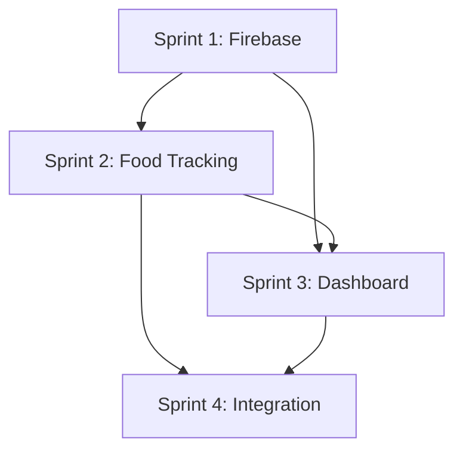

# Phase 3: Sprint Summary & Planning Overview
## Food Tracking & Enhanced Health Metrics Implementation

**Phase**: 3 - Food Tracking & Enhanced Health Metrics  
**Duration**: 7 weeks (4 sprints)  
**Total Story Points**: 123  
**Status**: IN PLANNING  

---

## Sprint Overview

### Sprint Allocation & Timeline

| Sprint | Duration | Focus Area | Stories | Points | Key Deliverables |
|--------|----------|------------|---------|--------|------------------|
| **Sprint 1** | Week 1-2 | Firebase Foundation | 5 stories | 29 points | Backend setup, auth, data models |
| **Sprint 2** | Week 3 | Food Tracking Core | 5 stories | 32 points | Meal logging, nutrition engine |
| **Sprint 3** | Week 4 | Dashboard & Health Metrics | 5 stories | 29 points | Visualization, additional tracking |
| **Sprint 4** | Week 5-7 | Integration & Launch | 5 stories | 33 points | Testing, optimization, deployment |

### Sprint Velocity Planning
- **Target Velocity**: 30-35 story points per sprint
- **Buffer Allocation**: 20% for bug fixes and refinement
- **Risk Mitigation**: Sprint 4 has 3 weeks for integration complexity
- **Team Capacity**: Assumes 4-person development team

---

## Sprint 1: Firebase Foundation & Backend (Week 1-2)

### Sprint Goal
Establish robust Firebase backend infrastructure to support all Phase 3 food tracking and health metrics with secure user authentication and real-time data synchronization.

### Epic Focus
**Epic 6: Firebase Foundation & Backend**

### User Stories
1. **Story 6.1**: Firebase Project Setup & Configuration (8 points) ✅ COMPLETED
   - Firebase services setup, security rules, environment config
2. **Story 6.1a**: Password Reset Functionality (3 points) 🆕
   - Secure password recovery with email and deep links
3. **Story 6.1b**: Logout Functionality (2 points) 🆕
   - Complete session termination and state cleanup
4. **Story 6.2**: User Authentication System (5 points)
   - Registration, login, integration with reset/logout systems
5. **Story 6.3**: Core Data Models & Types (3 points)
   - TypeScript interfaces, validation, mock data generators
6. **Story 6.4**: Firebase Service Layer (8 points)
   - CRUD operations, real-time subscriptions, offline queue
7. **Story 6.5**: Basic Zustand Store Setup (5 points)
   - Auth, Nutrition, Health, UI stores with persistence

### Success Criteria
- [ ] Firebase backend operational in development environment
- [ ] User authentication flow complete end-to-end
- [ ] Data models defined and service layer functional
- [ ] State management stores integrated with Firebase
- [ ] Security rules prevent unauthorized data access

### Key Risks
- **Firebase setup complexity**: Allocate extra time for configuration
- **Authentication edge cases**: Comprehensive error handling required
- **State management architecture**: Foundation affects all future stories

---

## Sprint 2: Food Tracking Core System (Week 3)

### Sprint Goal
Build complete food tracking system enabling users to log meals across 5 categories with photo capture, nutrition calculations, and meal review capabilities.

### Epic Focus
**Epic 7: Food Tracking System**

### User Stories
1. **Story 7.1**: Meal Category Selection Interface (5 points)
   - 5 meal categories with visual states and navigation
2. **Story 7.2**: Food Entry Form (8 points)
   - Food name, quantity, units, validation, photo attachment
3. **Story 7.3**: Nutrition Calculation Engine (5 points)
   - Random nutrition generation, meal/daily totals
4. **Story 7.4**: Photo Capture & Upload (8 points)
   - Camera/gallery access, compression, Firebase Storage
5. **Story 7.5**: Meal Summary View (6 points)
   - Complete meal overview with edit/delete functionality

### Success Criteria
- [ ] All 5 meal categories functional and visually correct
- [ ] Food entry form validates and saves successfully
- [ ] Nutrition calculations generate realistic data
- [ ] Photo capture and upload working smoothly
- [ ] Meal summaries show complete information

### Key Dependencies
- Sprint 1 completion: Firebase backend must be operational
- UI design specifications: Reference screenshots for visual accuracy
- Form handling: React Hook Form integration

---

## Sprint 3: Dashboard & Health Metrics (Week 4)

### Sprint Goal
Create comprehensive nutrition dashboard with visual progress indicators and implement additional health metrics tracking for complete wellness monitoring.

### Epic Focus
**Epic 8: Nutrition Dashboard & Health Metrics**

### User Stories
1. **Story 8.1**: Daily Nutrition Overview Dashboard (8 points)
   - Circular calorie progress, macro bars, color-coded indicators
2. **Story 8.2**: Date Picker & Historical Navigation (6 points)
   - Calendar picker, historical data loading, empty states
3. **Story 8.3**: Weight Tracking System (5 points)
   - Weight entry, trend analysis, BMI calculation
4. **Story 8.4**: Water Intake Tracking (4 points)
   - Quick-add buttons, progress visualization, goal tracking
5. **Story 8.5**: Steps & Workout Tracking (6 points)
   - Manual input, workout logging, activity summaries

### Success Criteria
- [ ] Nutrition dashboard displays real-time progress accurately
- [ ] Date navigation loads historical data smoothly
- [ ] All health metrics capture and display data correctly
- [ ] Visual progress indicators provide clear feedback
- [ ] Performance smooth with complex data visualizations

### Key Dependencies
- Sprint 2 completion: Food tracking data needed for dashboard
- Animation libraries: React Native Reanimated for smooth transitions
- Calendar component: React Native Calendars integration

---

## Sprint 4: Integration & Launch Preparation (Week 5-7)

### Sprint Goal
Integrate all Phase 3 features into cohesive system, ensure comprehensive testing, optimize performance, and prepare for production launch.

### Epic Focus
**Epic 9: System Integration & Launch**

### User Stories
1. **Story 9.1**: Cross-Feature Data Integration (8 points)
   - Health data aggregation, calorie balance, health scoring
2. **Story 9.2**: Comprehensive Testing Suite (10 points)
   - Unit, integration, E2E, performance, accessibility testing
3. **Story 9.3**: Performance Optimization (6 points)
   - Response times, memory usage, animation smoothness
4. **Story 9.4**: Error Handling & Edge Cases (5 points)
   - Network failures, data validation, user guidance
5. **Story 9.5**: Launch Preparation & Documentation (4 points)
   - User onboarding, help system, release materials

### Success Criteria
- [ ] All health data integrated seamlessly
- [ ] Test coverage >80% with comprehensive validation
- [ ] Performance meets all specified targets
- [ ] Error scenarios handled gracefully
- [ ] Launch documentation complete and approved

### Extended Timeline Rationale
- **Week 5**: Focus on integration and initial testing
- **Week 6**: Comprehensive testing, performance optimization
- **Week 7**: Final polish, documentation, launch preparation

---

## Cross-Sprint Considerations

### Dependencies Management

### Risk Mitigation Strategies
1. **Technical Risks**
   - Firebase complexity: Extra time in Sprint 1
   - Photo upload performance: Parallel development with compression
   - Animation performance: Early testing on low-end devices

2. **Integration Risks**
   - Cross-feature data flow: Dedicated integration sprint
   - State management complexity: Regular architecture reviews
   - Performance degradation: Continuous monitoring

3. **Timeline Risks**
   - Feature creep: Strict scope adherence
   - Testing bottlenecks: Parallel test development
   - Launch delays: Buffer time in Sprint 4

---

## Team Coordination

### Sprint Planning Process
1. **Sprint Planning Meeting**: 4-hour session for each sprint
2. **Story Refinement**: Ongoing throughout previous sprint
3. **Capacity Planning**: Account for holidays, PTO, sick days
4. **Dependency Review**: Ensure prerequisite stories complete

### Daily Coordination
- **Daily Standups**: Focus on blockers and dependencies
- **Pair Programming**: For complex integrations and testing
- **Code Reviews**: Mandatory for all story completions
- **Sprint Reviews**: Demo progress to stakeholders

### Quality Gates
- **Sprint 1**: Firebase operations and auth working
- **Sprint 2**: End-to-end food logging functional
- **Sprint 3**: Complete dashboard with all health metrics
- **Sprint 4**: Production-ready with comprehensive testing

---

## Success Metrics

### Sprint-Level Metrics
- **Velocity Tracking**: Actual vs. planned story points
- **Story Completion Rate**: Stories completed vs. planned
- **Quality Metrics**: Bugs found per story, test coverage
- **Performance Metrics**: Response times, memory usage

### Phase-Level Success Criteria
- [ ] Food logging completion rate >90%
- [ ] Daily active user engagement +40%
- [ ] User retention rate >85% after launch
- [ ] Average session length increase +60%
- [ ] Nutrition tracking satisfaction >4.2/5

---

## Resource Allocation

### Team Composition
- **Frontend Developer**: UI components, animations, user interactions
- **Backend Developer**: Firebase integration, data management
- **Full-Stack Developer**: Cross-feature integration, performance
- **QA Engineer**: Testing, quality assurance, user acceptance

### Tool & Infrastructure Needs
- **Development**: Firebase project, development devices
- **Testing**: Simulator access, device testing lab
- **Design**: Figma access, asset management
- **Project Management**: Sprint tracking, burndown charts

---

**Sprint Planning Lead**: Scrum Master  
**Technical Lead**: Senior Developer  
**Product Owner**: Product Manager  
**Next Review**: Pre-Sprint 1 Planning Session