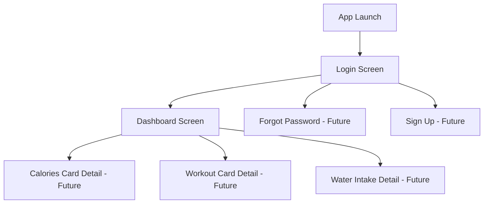
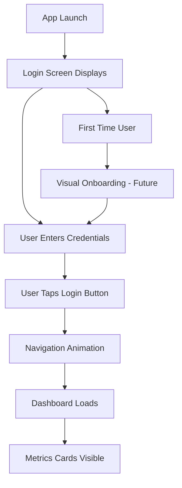

# Mobile Health Dashboard UI/UX Specification

## Introduction

This document defines the user experience goals, information architecture, user flows, and visual design specifications for the Mobile Health Dashboard application. It serves as the foundation for visual design and frontend development, ensuring a cohesive and user-centered experience that leverages contemporary mobile design trends.

### Overall UX Goals & Principles

#### Target User Personas
- **Health-Conscious Millennials**: Tech-savvy users (25-40) who want quick daily health insights without complexity
- **Fitness Enthusiasts**: Active users who expect polished, responsive interfaces with immediate visual feedback
- **Wellness Beginners**: Users new to health tracking who need clear, intuitive guidance and encouraging design

#### Usability Goals
- **Instant Recognition**: Users understand core functionality within 5 seconds of app launch
- **Thumb-Friendly Navigation**: All primary actions accessible with single-handed use on devices 4.7" - 6.7"
- **Zero Learning Curve**: Login and dashboard navigation require no tutorial or explanation
- **Delightful Interactions**: Micro-animations and feedback create positive emotional connection

#### Design Principles
1. **Clarity over Complexity** - Prioritize scannable information hierarchy over decorative elements
2. **Progressive Disclosure** - Show essential metrics first, detailed views accessible through intuitive gestures
3. **Biophilic Design** - Incorporate organic shapes and health-positive colors that reduce stress
4. **Accessible by Design** - Meet WCAG 2.1 AA standards while maintaining visual appeal
5. **Performance First** - Every design decision considers 60fps interactions and quick load times

### Change Log
| Date | Version | Description | Author |
|------|---------|-------------|--------|
| 2025-01-24 | 1.0 | Initial UX specification with modern mobile patterns | UX Expert |
| 2025-08-30 | 2.0 | Updated with sample image designs and comprehensive tracking UI | UX Expert |

## Updated Design System (Based on Sample Images)

### Color Palette 
**Primary Brand Colors:**
- **Teal Primary**: #2DD4BF (Upgrade buttons, active states, special CTAs)
- **Teal Secondary**: #14B8A6 (Calendar selection, progress indicators)
- **Background**: #F8FAFC (Main app background, similar to existing)
- **Card Background**: #FFFFFF (All tracker cards)
- **Text Primary**: #1F2937 (Main headings, card titles)
- **Text Secondary**: #6B7280 (Subtitles, goal descriptions)

**Accent Colors for Tracking Categories:**
- **Food/Nutrition**: #F97316 (Orange - fork/knife icons)
- **Workout/Exercise**: #EC4899 (Pink - timer/workout icons)
- **Weight**: #6366F1 (Indigo - scale icons)  
- **Water**: #06B6D4 (Cyan - water glass icons)
- **Steps**: #10B981 (Green - footprint icons)
- **Sleep**: #8B5CF6 (Purple - moon icons)

### Typography System
**Font Family**: System Default (SF Pro on iOS, Roboto on Android)

**Text Styles:**
- **H1 - Section Headers**: 24px, Bold (600), #1F2937
- **H2 - Card Titles**: 18px, Medium (500), #1F2937  
- **Body - Values**: 16px, Bold (600), #1F2937
- **Caption - Goals**: 14px, Regular (400), #6B7280
- **Button Text**: 16px, Medium (500), #FFFFFF

### Layout and Spacing
**Grid System**: 8px base unit
- **Screen Padding**: 24px horizontal margins
- **Card Spacing**: 16px between cards
- **Internal Card Padding**: 20px all sides
- **Icon Sizes**: 24px standard, 48px for profile avatar
- **Button Heights**: 48px minimum for accessibility

## Enhanced Information Architecture (IA)

### Updated Screen Inventory
**Core App Structure:**
1. **Login Screen** (Existing - Phase 1 Complete)
2. **Enhanced Dashboard** (Updated - Phase 2)
   - User profile header with avatar and "Upgrade Now"
   - "Today" date selector with calendar modal
   - Comprehensive tracker cards with nutrition breakdown
   - Bottom tab navigation
3. **Tracking Selection Modal** (New - Phase 2)
   - Bottom sheet with 6 tracking categories
4. **Calendar Selection Modal** (New - Phase 2)
   - Month view with date selection
5. **Individual Tracking Screens** (Future - Phase 3)

### Navigation Structure
**Bottom Tab Navigation:**
- **Home** (Current dashboard)
- **Plans** (Future - meal/workout plans)
- **Add (+)** (Triggers tracking selection modal)
- **AI Riq** (Future - AI insights)
- **Store** (Future - premium features)

## Information Architecture (IA)

### Site Map / Screen Inventory

### Navigation Structure

**Primary Navigation:** Screen-to-screen flow with gesture-based back navigation
**Secondary Navigation:** In-app deep linking for metric card expansions (future)
**Breadcrumb Strategy:** Native mobile stack navigation with clear visual hierarchy

## User Flows

### Primary User Flow: Login to Dashboard

**User Goal:** Access health dashboard with minimal friction
**Entry Points:** App launch icon tap
**Success Criteria:** User sees dashboard metrics within 3 taps maximum

#### Flow Diagram

#### Edge Cases & Error Handling:
- **Empty form submission**: Visual field highlighting with helpful messaging
- **Network connectivity**: Graceful offline mode indication for future backend
- **Screen rotation**: Maintain form state and visual hierarchy
- **Interruptions**: Background app handling preserves user input

**Notes:** Current implementation focuses on UI flow without validation logic

## Component Library / Design System

### Design System Approach
**Modern Health-Focused Component System** leveraging shadcn/ui components with TweakCN theme customization for contemporary mobile health aesthetics.

### Core Components

#### Input Component
**Purpose:** Form inputs with health app styling
**Variants:** Text, Email, Password, Number
**States:** Default, Focused, Filled, Error, Disabled
**Usage Guidelines:** Always include proper labels and use appropriate keyboard types

#### Button Component  
**Purpose:** Primary and secondary actions throughout the app
**Variants:** Primary, Secondary, Ghost, Outline
**States:** Default, Pressed, Loading, Disabled
**Usage Guidelines:** Minimum 44px touch target with haptic feedback on press

#### Card Component
**Purpose:** Metric display containers with consistent styling
**Variants:** Metric Card, Summary Card, Action Card
**States:** Default, Pressed, Loading
**Usage Guidelines:** Use consistent padding and maintain visual hierarchy

#### Icon Component
**Purpose:** Consistent iconography throughout the application
**Variants:** Health metrics (heart, water, exercise), UI actions (arrow, check)
**States:** Default, Active, Disabled
**Usage Guidelines:** Maintain 24px minimum size for accessibility

## Branding & Style Guide

### Visual Identity
**Brand Guidelines:** Modern wellness aesthetic emphasizing trust, energy, and clarity

### Color Palette
| Color Type | Hex Code | Usage |
|------------|----------|-------|
| Primary | #10B981 | Primary actions, progress indicators, positive metrics |
| Secondary | #6366F1 | Secondary actions, links, informational elements |
| Accent | #F59E0B | Highlights, achievements, warnings |
| Success | #22C55E | Positive feedback, completed goals |
| Warning | #F59E0B | Important notices, moderate alerts |
| Error | #EF4444 | Errors, critical alerts, destructive actions |
| Neutral | #64748B, #94A3B8, #E2E8F0 | Text hierarchy, borders, backgrounds |

### Typography

#### Font Families
- **Primary:** Inter (system font fallback: SF Pro Display, Roboto)
- **Secondary:** Inter (consistent across all elements)
- **Monospace:** JetBrains Mono (for metric values requiring precise alignment)

#### Type Scale
| Element | Size | Weight | Line Height |
|---------|------|--------|-------------|
| H1 | 32px | 700 | 1.2 |
| H2 | 24px | 600 | 1.3 |
| H3 | 20px | 600 | 1.4 |
| Body | 16px | 400 | 1.5 |
| Small | 14px | 400 | 1.4 |

### Iconography
**Icon Library:** Lucide React icons with custom health-focused additions
**Usage Guidelines:** Consistent 24px base size, use outline style for better mobile legibility

### Spacing & Layout
**Grid System:** 8px base unit with 16px, 24px, 32px rhythm
**Spacing Scale:** 4px, 8px, 16px, 24px, 32px, 48px, 64px

## Accessibility Requirements

### Compliance Target
**Standard:** WCAG 2.1 AA with mobile-specific enhancements

### Key Requirements

**Visual:**
- Color contrast ratios: 4.5:1 minimum for normal text, 3:1 for large text
- Focus indicators: 2px solid outline with high contrast color
- Text sizing: Respects system font size preferences up to 200%

**Interaction:**
- Keyboard navigation: Full app navigable with external keyboard
- Screen reader support: Proper semantic markup and ARIA labels
- Touch targets: Minimum 44px x 44px with adequate spacing

**Content:**
- Alternative text: Descriptive alt text for all icons and images
- Heading structure: Logical h1-h6 hierarchy for screen readers
- Form labels: Clear association between labels and form controls

### Testing Strategy
Automated accessibility testing with @react-native-community/eslint-plugin-accessibility and manual testing with iOS VoiceOver and Android TalkBack

## Responsiveness Strategy

### Breakpoints
| Breakpoint | Min Width | Max Width | Target Devices |
|------------|-----------|-----------|----------------|
| Small | 320px | 414px | iPhone SE, smaller Android phones |
| Medium | 415px | 768px | iPhone 14, standard Android phones |
| Large | 769px | 1024px | iPhone 14 Plus, phablets |
| XL | 1025px+ | - | Tablets in portrait mode |

### Adaptation Patterns

**Layout Changes:** Card grid adjusts from 1 column (small) to 2 columns (large), maintaining 16px gutters
**Navigation Changes:** Consistent single-screen navigation across all sizes
**Content Priority:** Metric values prominently displayed with secondary information progressively disclosed
**Interaction Changes:** Touch targets automatically adjust for device size, minimum 44px maintained

## Animation & Micro-interactions

### Motion Principles
Contemporary mobile motion design emphasizing purposeful, physics-based animations that provide clear feedback and maintain user attention without distraction.

### Key Animations
- **Screen Transitions:** Slide transition (320ms, easeOutQuart) for login → dashboard
- **Button Press:** Scale down to 0.95 (120ms, easeOut) with haptic feedback
- **Card Interactions:** Subtle lift shadow (200ms, easeOut) on press
- **Loading States:** Pulse animation (1200ms, infinite) for metric placeholders
- **Form Focus:** Input border color transition (200ms, easeInOut)

## Performance Considerations

### Performance Goals
- **Page Load:** Dashboard appears within 100ms of navigation trigger
- **Interaction Response:** Touch feedback begins within 16ms (1 frame)
- **Animation FPS:** Maintain 60fps during all transitions and interactions

### Design Strategies
Optimize for React Native performance by minimizing re-renders, using FlatList for future scrollable content, and implementing proper image lazy loading for future media content.

## Detailed Screen Specifications

### Login Screen Layout

**Visual Hierarchy:**
1. **Header Section** (Top 25% of screen)
   - Logo/branding centered
   - Subtle background gradient or pattern
   
2. **Form Section** (Middle 50% of screen)
   - Email input with floating label
   - Password input with show/hide toggle
   - Login button with primary brand color
   - Consistent 24px spacing between elements
   
3. **Footer Section** (Bottom 25% of screen)
   - Future space for "Forgot Password" and "Sign Up" links
   - Legal text or version information

**Component Specifications:**
- **Email Input**: Floating label, email keyboard type, auto-capitalization disabled
- **Password Input**: Secure entry with toggle visibility icon, appropriate content type
- **Login Button**: Full width with 16px horizontal margin, 12px vertical padding, rounded corners (8px)

### Dashboard Screen Layout

**Visual Hierarchy:**
1. **Header Section**
   - Welcome greeting or date display
   - Optional user avatar placeholder (future)
   - 16px top padding, 24px horizontal padding
   
2. **Metrics Grid Section**
   - 3 metric cards in responsive grid
   - 16px spacing between cards
   - 24px horizontal page margins
   
3. **Footer Section**
   - Future navigation or action buttons
   - Safe area padding consideration

**Metric Card Specifications:**
- **Dimensions**: Minimum 160px width, 120px height
- **Layout**: Icon (top-left), Value (center), Label (bottom)
- **Styling**: 8px border radius, subtle shadow (0 2px 4px rgba(0,0,0,0.1))
- **Typography**: Value in large semibold, label in small regular
- **Icons**: 32px size, positioned with 12px padding from edges

### Calories Card Detail
- **Icon**: Flame or apple icon in warm color (#F59E0B)
- **Value**: "1,200" with "kcal" unit
- **Label**: "Calories Today"

### Workout Card Detail  
- **Icon**: Dumbbell or activity icon in energetic color (#10B981)
- **Value**: "45" with "mins" unit
- **Label**: "Workout Time"

### Water Intake Card Detail
- **Icon**: Water drop icon in cool color (#06B6D4)
- **Value**: "2.5" with "L" unit  
- **Label**: "Water Intake"

## Next Steps

### Immediate Actions
1. Review specifications with development team for technical feasibility
2. Create design tokens/theme configuration for shadcn/TweakCN integration
3. Develop interactive prototype for user testing validation
4. Set up design system documentation for component consistency

### Design Handoff Checklist
- [x] All user flows documented
- [x] Component inventory complete  
- [x] Accessibility requirements defined
- [x] Responsive strategy clear
- [x] Brand guidelines incorporated
- [x] Performance goals established